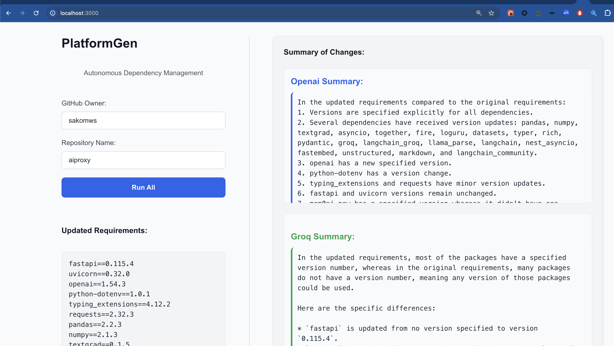

# Session Title: Intro to workshop / Hackathon Building Blocks

Welcome to the **Intro to workshop / Hackathon Building Blocks** session of the DevFest AI Workshop! This session will guide you through [brief session purpose or topic].

---

## Session Overview

**Instructor:** [Sako M](https://www.linkedin.com/in/sakom)

**Duration:** 30 minutes

**Objective:**  
- Set up and configure the Py API.
- Learn to interact with different endpoints to manage dependencies.
- Understand the process of automating dependency updates in a GitHub repository.
  
By the end of this session, you will have a deeper understanding of [specific concepts/skills].

---

## Prerequisites

- Basic knowledge of Python and FastAPI.
- A GitHub account and a personal access token (PAT).
- Python 3.8+ installed on your machine.

---

## Agenda

**Introduction**  
PlatformGen - Autonomous Dependency Manager.

🔧 Motivation: 
- Regular infrastructure upgrades are essential for performance, security, and sustainability. 
- Building long-term solutions, not just short-term fixes, helps ensure smooth, efficient operations.

⚠️ The Problem:
- Managing dependencies becomes complex as codebases grow.
- It's time-consuming, costly, and increases the risk of failures.
- Scaling services and maintaining fast development cycles are major challenges.

💡 How Big is the Problem?
- Downtime can cost Fortune 1,000 companies up to $1 million per hour (IDC survey). 
- Large enterprises might spend $60 million or more on incidents annually (IHS Research).

✅ Our Solution: Progressive automation, moving from manual support to full automation maturity. 


**Q&A and Discussion**  
   - Please, submit the questions as issue and label relevant session: https://github.com/sakomws/ai-workshop/labels

---

## Instructions

### Step 1: Clone the Workshop Repository
If you haven't cloned the repository already, run:
```bash
git clone https://github.com/sakomw/ai-workshop.git
cd ai-workshop/sessions/session_1
```

### Step 2: Set Up Environment
- Setup secrets in code/backend/.env.local and name it .env:
```
GITHUB_TOKEN=x
OPENAI_API_KEY=x
GROQ_API_KEY=x
```
- Install [flox](https://flox.dev):
  ```bash
  brew install flox
  flox pull sakomws/01_intro_workshop
  flox activate
  ```
- Install any necessary dependencies for backend:
  ```bash
  cd 01_intro_workshop
  cd code/backend
  pip install -r requirements.txt
  uvicorn main:app --reload
  ```

- See the directory structure in backend:
```
├── cf_aiproxy.py
├── config.py
├── main.py
├── models
│   ├── __init__.py
│   └── schemas.py
├── requirements.txt
├── routes
│   ├── __init__.py
│   └── api_routes.py
└── services
    ├── __init__.py
    ├── dependency_service.py
    └── github_service.py
```

- Install any necessary dependencies for the frontend:
  ```bash
  cd 01_intro_workshop
  cd code/frontend
  yarn install
  yarn dev
  ```

### Step 3: Demo
- Open in browser and select the repo with requirements.txt file in root folder: http://localhost:3000


---

## Additional Resources
- [Groq]()
- [FastAPI]()
- [NexJS]()
- [Cloudflare AI Gateway](https://www.cloudflare.com/)
- [Hackathon Playbook](https://www.magcloud.com/browse/issue/2908303)
---

## Contact

If you have questions during the workshop, please reach out to **[Sako M]** or open an issue in the repository.

Happy coding!


