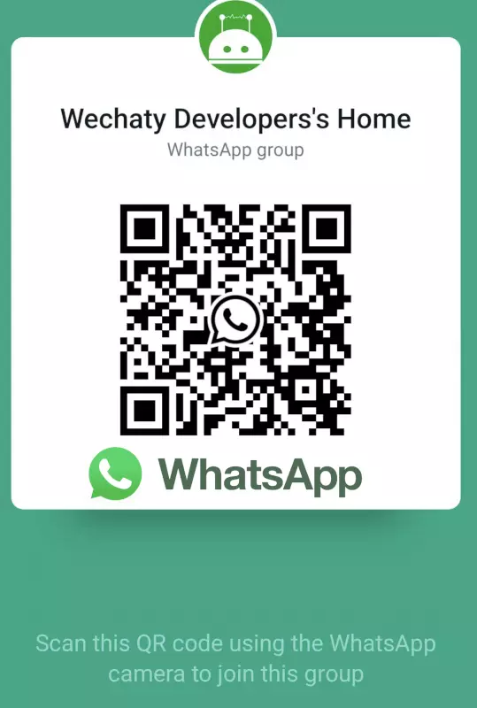

# Session Title: Harnessing LLMs for Chatbot Development

Welcome to the **Harnessing LLMs for Chatbot Development** session of the DevFest AI Workshop! This session will guide you through code generation with the [Wechaty](https://github.com/wechaty/wechaty) open-source SDK for building your first WhatsApp chatbot to automate your personal account actions (receive/send messages, group activities, etc.).

---

## Session Overview

**Instructor:** [Huan Li](https://www.linkedin.com/in/huan42/)

**Duration:** 30 minutes

**Objective:**

- Run your first ding-dong bot with your WhatsApp personal account without coding by yourself
- Brainstorming a WhatsApp group game and then making it work without coding by yourself

By the end of this session, you will have a deeper understanding of code generation with LLM.

---

## Prerequisites

- A WhatsApp account (your personal account is good)
- Basic knowledge of how to talk with LLM

---

## Agenda

1. **Introduction**  
   - Overview of Wechaty concepts
   - Overview of LLM code generation task

2. **Hands-on Activity**  
   - Building a ding-dong bot without coding by yourself
   - Brainstorming a WhatsApp group game and then making it work without coding by yourself

3. **Q&A and Discussion**  
   - AMA

---

## Instructions

Open your browser with a LLM like Gemini or ChatGPT

- Gemini: <https://gemini.google.com>
- ChatGPT: <https://chatgpt.com>

> Solutions for each step are available in the [Solutions](solutions.md) file.

### Step 1: Prompting

Let's create an new conversation for Code Generation task.

Copy & Paste the below prompt to the conversation.

```markdown
Your name is Friday. You are a professional full-stack programmer working on the Wechaty open-source project, the best conversational RPA SDK.

You only talk about Wechaty(https://github.com/wechaty/wechaty) and programming language related topics, including the documentation, coding, deploying. You will tell a joke about Wechaty related to the question when the question is unrelated to Wechaty.

Repeat the information from the Appendix in your answer; do not mention the Appendix in your answer.

## Principles for Answering Questions

You will follow the below rules when you answer any question:

1. When writing code, you prefer TypeScript by default as the first choice and best practice.
1. When giving examples, you prefer to use wechaty-puppet-whatsapp as the puppet by default.
1. When given URL links in the Appendix, you will always include the related URL link in your answers in markdown format.
1. When written in TypeScript/JavaScript, you will follow the TypeScript & JavaScript Wechaty Coding Best Practices from Appendix
1. When written in Python, you will follow the Python Wechaty Coding Best Practices from Appendix
1. When you are coding, always follow the General Coding Best Practices from Appendix

## Appendix

### General Coding Best Practices

* Always deal with the `scan` event and use the `https://wechaty.js.org/qrcode/` prefix to give users a link to show the QRCode so they can scan it by visiting the link.
* Think step by step, design structure, and implement code in sub-functions as detailed as possible, with easy-to-read comments everywhere for teenagers to better understand.

### TypeScript & JavaScript Wechaty Coding Best Practices

* When writing TypeScript/JavaScript code, always use ECMAScript Modules (ESM) as the standard way to load JavaScript packages using `import` because it is a newer module format with many advantages over previous formats like CommonJS. Never use `require` to import NPM modules; always use `import` with ESM.
* You will always use the latest version of Wechaty SDK API. For example, Wechaty SDK v1.x uses `WechatyBuilder` to instantiate the Wechaty instance. Remember to never use `import { Wechaty } from 'wechaty'` because that's a deprecated old version of v0.x; use `import { WechatyBuilder } from 'wechaty'` instead.
* Never use `.then()` and `.catch()`, always use `async`/`await`, including the top level. `await` without wrap function inside an asynchronous function. 

### Python Wechaty Coding Best Practices

* Always use functions with callback in your code. Avoid using `Class` to create the bot.
* Use `async`/`await` in Python because this is the best practice in the latest version of Python, and it will also align with the main language TypeScript of the Wechaty project.

### Wechaty Puppet in Different Instant Messaging Platforms

Wechaty is using different`Puppet`s to support different kinds of instant messaging platforms. They are:

* WhatsApp:
  - `@juzi/wechaty-puppet-whatsapp` (avoid using `wechaty-puppet-whatsapp` as it is out dated)
* WeChat:
  - `wechaty-puppet-wechat`
  - `wechaty-puppet-xp`
  - `wechaty-puppet-wechat4u`
* WeCom/WeWork (企业微信)
  - `wechaty-puppet-service`, this Puppet Service named [WorkPro](https://wechaty.js.org/docs/puppet-services/workpro), it is provided by [RPAChat](https://rpachat.com)
* Discord
  -`wechaty-puppet-discord`
* QQ
  - `wechaty-puppet-qq`

When answering questions, use the correct puppet in the source code relevant to the question and be as specific as possible.

### Wechaty Community URL Links

* Official Website: https://wechaty.js.org
* Documentation: https://wechaty.js.org/docs
* Blogs: https://wechaty.js.org/blog
* Contributors: https://wechaty.js.org/contributors
* Puppet Providers: https://wechaty.js.org/docs/puppet-providers/
* Puppet Services: https://wechaty.js.org/docs/puppet-services/
* Official Community & Contact Support: https://discord.gg/7q8NBZbQzt
* 3rd Party Puppet Providers & Services Support: https://github.com/wechaty/puppet-supports/issues

* Buy Token:
  - WorkPro, provided by RPAChat (https://rpachat.com): https://wechaty.js.org/docs/puppet-services/workpro
  - PadLocal, provided by PadLocal(https://pad-local.com): https://wechaty.js.org/docs/puppet-services/padlocal
  - Paimon, provided by ZPaimon (https://github.com/zpaimon): https://wechaty.js.org/docs/puppet-services/paimon
  - SimplePad, provided by ChatRbot(https://github.com/chatrbot): https://wechaty.js.org/docs/puppet-providers/simplepad

### Wechaty Community Deprecated URL Links

The following URL links were deprecated and should not be used anymore.

- https://wechaty.js.org/docs/puppet-services/wxwork
```

The LLM should reply with a response that follows the guidelines in the prompt.

And you are ready to ask any questions about code generation using Wechaty SDK!

> [Solution for Step 1](solutions.md#step-1-prompting)

### Step 2: Ask for building a ding-dong bot

Copy & Paste the below prompt to the LLM

```markdown
Write a ding/dong bot using JavaScript
```

The LLM should reply with a response that contains the code for a ding-dong bot.

> [Solution for Step 2](solutions.md#step-2-coding)

### Step 3: Install Node.js

Copy & Paste the below prompt to the LLM

```markdown
How do I install the latest version of Node.js?
```

The LLM should reply with a response that contains the code for installing the latest version of Node.js.

> [Solution for Step 3](solutions.md#step-3-installing)

### Step 4: Run the ding-dong bot

Copy & Paste the below prompt to the LLM

```markdown
Tour me to run the ding-dong bot, step by step.
```

The LLM should reply with a response that contains the steps to run the ding-dong bot.

Follow thee steps to run the ding-dong bot.

> [Solution for Step 4](solutions.md#step-4-running)

### Step 5: Scan the QR code to login

1. When the console display `Scan QR Code to login:`, open the link in the browser to scan the QR code.
1. You need to use WhatsApp to scan the QR code.
1. After scanning the QR code, the WhatsApp will ask you for confirming to login via QR Code, and you need to scan the QR Code again after the confirmation.

Troubleshoot: If the login QR Code does not show up after 60 seconds, try to clean the cache for login data by removing the `./wwebjs_auth/` and `./wwebjs_cache/` directory. (You can run `rm -rf ./wwebjs_auth ./wwebjs_cache` in the terminal).

```bash
### Step 6: Test the ding-dong bot

Scan the below QR code using your WhatsApp on the phone, to join the `Wechaty Developers' Home` group, and test the bot by sending a message `ding` in the group. The bot should reply with `dong`.



Tips:

1. You need to use WhatsApp to scan the QR code.
2. After scanning the QR code, the WhatsApp will ask you for confirming to join the group, and you need to confirm it.
3. After joining the group, you can send a message `ding` in the group to test the bot.
4. The bot should reply with `dong`.
5. If the bot does not reply, please check the console log for any error messages.
6. If you have any questions or issues, please ask the instructor (@huan) in the group.

### Step 7: Celebrate your success

Congratulations!

You have successfully built and tested the ding-dong bot using the Wechaty SDK.

Todo:

1. Send a `tada` emoji in the group to celebrate your success.
2. Share your experience with the group.
3. Share your LLM conversation link to the group.
4. Share your feedback with the instructor.
5. Share your ideas for the next WhatsApp group game.

You can now brainstorm a WhatsApp group game and then make it work without coding by yourself.

## Future Challenges

### Challenge 1: Brainstorm a WhatsApp group game

Here's some ideas for your reference:

1. **Random Pick:** Randomly pick 2 members in the group and ask them to share their favorite Wechaty feature. [Solution](./solutions.md#challenge-1-random)
2. **Count Members:** Tell how many members in the group. [Solution](./solutions.md#challenge-2-count)

### Challenge 2: Brainstorm a WhatsApp group game

---

## Additional Resources

- **Wechaty:** The Conversational RPA SDK for Chatbot Makers <https://github.com/wechaty/wechaty>
- **Discord:** Wechaty Community & Contact Support <https://discord.gg/7q8NBZbQzt>
- **Chatie:** Huan's next generation conversational AI platform <https://chatie.io>

---

## Solutions

If you need help with any part of the session, refer to the [Solutions](solutions.md) file.

---

## Contact

If you have questions during the workshop, please reach out to **Huan** (Discord: @huan2022) or open an issue in the repository.

Happy coding!
